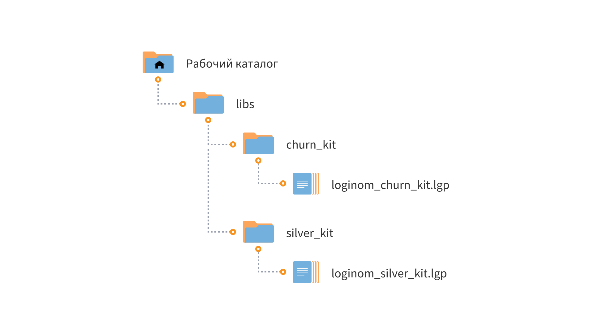

# Loginom Churn Kit CE

* Версия: 3.1.0
* Проверено: Loginom CE 7.3.1

Компоненты библиотеки **Loginom Churn Kit CE** решают следующие задачи:

* определение дат ухода клиентов «наивным» методом и методом, учитывающим индивидуальную частоту визитов (для неконтрактной системы взаимоотношений);
* определение порогового индекса оттока, соответствующего собственным интервалом неактивности клиентской базы;
* расчет значений индексов оттока для каждого клиента на заданную дату;
* построение кривых удержания клиентов;
* динамики удержания и оттока клиентов при контрактной и неконтрактной системе взаимоотношений; с реактивацией и без реактивации.

Также имеются компоненты для определения дат ухода и оптимального интервала неактивности клиента несколькими методами: от простых до индивидуальных (через «индекс оттока»). Для компонентов настроен ряд отчетов. Подробно это рассматривается в бизнес-курсе [Обнаружение и измерение оттока](https://loginom.ru/learning/content/churn-course) в Loginom Skills.

Компоненты находятся в пакете **loginom_churn_kit.lgp**.

# Установка и настройка

## Требования

Для работы  библиотеки **Loginom Churn Kit CE** необходимо:

* Loginom Community Edition. Коммерческие версии Loginom не поддерживаются;

* Библиотека **Loginom Silver Kit** ([скачать на GitHub](https://github.com/loginom/loginom-silver-kit)). Версия не ниже 3.2.0.

## Порядок установки

1. Определите рабочий каталог, где будут расположены ваши библиотеки на локальном диске.
2. Создайте в нем подкаталог **libs**.
3. Разместите папку **churn_kit** в каталоге **libs**.
4. Убедитесь, что библиотека **Loginom Silver Kit** находится в каталоге **libs** в папке **silver_kit**.

